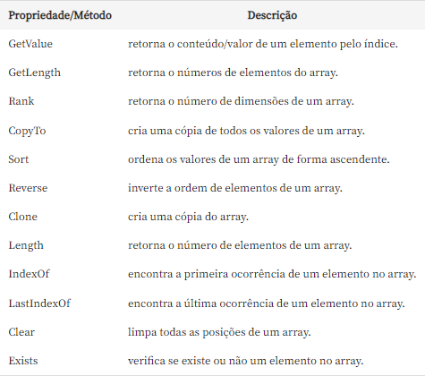

##Estudos de backend com C#

### Criando Listas
- Declarando um Array: int[] idades = new int[5];
- Acessando os índices do Array e os exibindo com uma interpolação de String: 
int[] idades = new int[5];
void TestaArrayInt(){
    idades[0] = 15;
    idades[1] = 28;
    idades[2] = 35;
    idades[3] = 50;
    idades[4] = 28;
    Console.WriteLine($"Tamanho do Array {idades.Length}");
}
##### Criando um acumulador dessa array: 
 int acumulador = 0;
  foreach (var idade in idades){
      Console.WriteLine(idade);
      acumulador +=idade;
  }
  Console.WriteLine($"Soma das idades: {acumulador}");
##### Calculando a média dos valores do Array: 
  int media = acumulador/idades.Length;
  Console.WriteLine($"Soma das idades: {acumulador}");
  Console.WriteLine($"Média das idades: {media}");
  ##### Declarando Array e inicializando na mesma linha
  string [] palavras= new string[5] {"André","Jose","Andressa","Neia","Sarah"}`.
  double[] valores={2.6,9.7,7.5,1.8};
 Material da documentação: https://learn.microsoft.com/pt-br/dotnet/csharp/language-reference/builtin-types/arrays
### Aula 2 - Buscando palavras de uma lista
##### Código testando a busca por uma palavra retornando a posição e uma exception 
 void TestaBuscaPalavra() {
  string[] ArrayDePalavras = new string[5];
  int i = 0;
  foreach (var palavra in ArrayDePalavras) {
    Console.Write($"Digite a {i+1}ª palavra: ");
    ArrayDePalavras[i] = Console.ReadLine();   //O método ReadLine retorna uma string
    i++;
  }

  Console.Write("Digite a palavra a ser buscada:");
  var busca = Console.ReadLine();
  bool encontrou = false;

  for( int j = 0; j < ArrayDePalavras.Length; j++){
    if (busca == ArrayDePalavras[j]) { //if (busca.Equals(ArrayDePalavras[j]))
      Console.WriteLine($"A palavra foi encontrada na posição {j+1}");
      encontrou = true;
    }
  }
  if(!encontrou)
  throw new Exception("Palavra não encontrada");
}
##### Classe Array
A classe Array recebe como instância do objeto dois parâmetros que são o tipo e o número de elementos desse array. 
<c>Array amostra = Array.CreateInstance(typeof(double), 5); </c>
O método SetValue recebe dois parâmetros, cujo são valor e o índice do elemento:
<c> amostra.SetValue(6.9,4); </c>
<h5> O que é um cast? </h5> 
"Cast" é um termo usado em programação para se referir à conversão de um tipo de dados em outro. Em outras palavras, é quando você pega um valor de um tipo e "converte" ou "molda" esse valor em outro tipo.

Por exemplo, em C#, você pode ter um valor double que deseja usar como int. Você pode fazer isso usando um cast:

Neste exemplo, (int)x é um cast. Ele pega o valor double x e o converte em um int. Note que como int não pode representar números decimais, a parte decimal é simplesmente descartada na conversão.

Os casts podem ser explícitos ou implícitos. Um cast explícito é aquele que você escreve no código, como no exemplo acima. Um cast implícito é aquele que o compilador faz automaticamente quando é seguro fazê-lo. Por exemplo, você pode atribuir um int a um double sem precisar de um cast explícito, porque não há perda de informação na conversão:

Neste exemplo, o cast de x para double é implícito.
##### Criando um método para calcular a mediana de um array
void TestaMediana(Array array) //TestaMediana recebe como parâmetro um array do tipo Array
{ 
  if(array == null || array.Length ==0) //verficando se o array é nulo ou vazio
  Console.WriteLine("Array para o cálculo da mediana está nulo");
 
  double[] numerosOrdenados = (double [])array.Clone();  //Clonando um array e convertendo para um array do tipo double  
  Array.Sort(numerosOrdenados); //Ordenando o array com o método Sort

  int tamanho = numerosOrdenados.Length;  //Obtendo o tamanho do array
  int meio = tamanho / 2; //Obtendo o meio do array
  double mediana = tamanho % 2 == 0 ? (numerosOrdenados[meio-1] + numerosOrdenados[meio]) / 2 : numerosOrdenados[meio]; // ? : operador ternário que retorna um true ou false
  Console.WriteLine($"Com base na amostra a mediana é = {mediana}");
}
##### Principais propriedades da classe Array

##### Matrizes multidimensionais

int[,,] array3D = new int[,,] { { { 1, 2, 3 }, { 4, 5, 6 } },
                                { { 7, 8, 9 }, { 10, 11, 12 } } };

A matriz tridimensional array3D[1, 0, 1] é acessada da seguinte maneira:
O primeiro índice 1 refere-se à segunda matriz 2D dentro da matriz tridimensional.
O segundo índice 0 refere-se à primeira linha da segunda matriz 2D.
O terceiro índice 1 refere-se ao segundo elemento da primeira linha da segunda matriz 2D.
Então, se olharmos para a matriz 3D que você forneceu:

A expressão array3D[1, 0, 1] se refere ao número 8, que é o segundo elemento da primeira linha da segunda matriz 2D.

Lembre-se de que os índices em C# começam em 0, então o índice 1 se refere ao segundo elemento ou matriz.
- Representação visual da matriz: array3D: [
  [
    [1, 2, 3],
    [4, 5, 6]
  ],
  [
    [7, 8, 9],
    [10, 11, 12]
  ]
]
###### Método GetLength
método GetLength(int dimension) em C# retorna o número de elementos na dimensão especificada da matriz. A dimensão é zero-base, o que significa que a primeira dimensão é 0, a segunda é 1 e assim por diante.

Para uma matriz tridimensional como array3D, aqui está o que cada dimensão representa:

GetLength(0) retorna o número de matrizes 2D na matriz 3D.
GetLength(1) retorna o número de linhas em cada matriz 2D.
GetLength(2) retorna o número de elementos (ou colunas) em cada linha.
Portanto, se você tem uma matriz 3D de 2x2x3, GetLength(0) retornará 2 (duas matrizes 2D), GetLength(1) retornará 2 (duas linhas por matriz 2D) e GetLength(2) retornará 3 (três elementos por linha).

##### Diferenças entre arrays, listas e matrizes
Array: Um array é uma coleção de elementos do mesmo tipo que são armazenados contiguamente na memória. O tamanho de um array é fixo, o que significa que você não pode adicionar ou remover elementos após o array ser criado.

Lista (List): Uma lista em C# é uma coleção dinâmica de elementos. Isso significa que você pode adicionar ou remover elementos após a lista ser criada. A classe List<T> em C# fornece muitos métodos úteis para manipular listas.

Matriz: Uma matriz é um tipo especial de array que pode ter mais de uma dimensão. Por exemplo, uma matriz bidimensional é como uma tabela com linhas e colunas. Uma matriz tridimensional pode ser pensada como um cubo de números.

Em resumo, a principal diferença entre esses três tipos de coleções é que arrays e matrizes têm um tamanho fixo, enquanto listas têm um tamanho dinâmico. Além disso, matrizes podem ter mais de uma dimensão, enquanto arrays e listas são unidimensionais.